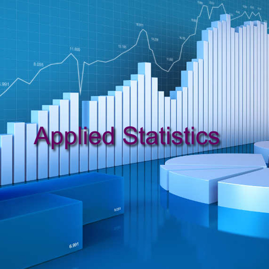

# Applied Statistics Assessment

**By Sharon Curley (G00438863@atu.ie)**

###### [Image from CCAP Courses](https://ccap.co.ke/course/bachelor-of-science-applied-statistics/)

This repository contains my Problem submission for the module Applied Statistics.

My github repository link is as follows:

[SBCURLEY/as-assessment](https://github.com/SBCURLEY/as-assessment)

## Installation
I had to install the below to get started on this repository
- Python 
- Visual Studio Code
- Cmder
- Jupyter notebook
- github

## Dependencies
The following libraries are required to execute my notebook:
- `matplotlib.pyplot`: Essential for creating static, animated, and interactive visualizations in Python. It is closely integrated with NumPy and provides a MATLAB-like interface for creating plots and visualizations.
- `numpy`: It contains functionality for multidimensional arrays, high-level mathematical functions such as linear algebra operations.
- `pandas`: Fundamental data analysis and manipulation library built on top of the Python programming language. It offers data structures and operations for manipulating numerical tables and time series.
- `math`: This module provides access to common mathematical functions and constants.
- `itertools`: This module implements a number of iterator building blocks inspired by constructs from APL, Haskell, and SML. Each has been recast in a form suitable for Python.
- `random`: This module implements pseudo-random number generators for various distributions.
- `scipy.stats`: This module contains a large number of probability distributions, summary and frequency statistics, correlation functions and statistical tests, masked statistics, kernel density estimation, quasi-Monte Carlo functionality, and more.
- `statsmodels`: It provides classes and functions for the estimation of many different statistical models, as well as for conducting statistical tests, and statistical data exploration.
- `seaborn`: Seaborn is a Python data visualization library based on matplotlib. It provides a high-level interface for drawing attractive and informative statistical graphics.

Using python, import the following as per notebook:

`import matplotlib.pyplot as plt`

`import numpy as np`

`import pandas as pd`

`import math`

`import itertools`

`import random`

`import scipy.stats as stats`

`import statsmodels as sm`

`import seaborn as sns`

## Usage
Once the above is installed, you can run the notebook for the project `problems.ipynb`

## Repository Structure

- Images folder: contains images used for the Readme & the problems notebook
- roughwork
- gitignore
- problems.ipynb. The Problems are contained in this Jupyter Notebook. 

The Problems notebook is structured as follows:

1. Description

2. Imports

3. Explore the Problems

  - Problem 1: Extending the Lady Tasting Tea
    - Introduction
    - Experimental Setup
    - Combinatorial reasoning
    - Ordered Selections
    - Null Hypothesis
    - Random Guessing
    - Pascals Triangle and the Lady Tasting Test
    - Plot the Distribution of Overlap Counts
    - Conclusion

  - Problem 2: Normal Distribution
    - Introduction
    - Population Standard Deviation vs Sample Standard Deviation
    - Plot Standard Deviation vs Sample Standard Deviation (n=10)
    - Describe the Differences
    - Increase Sample Size
    - Plot Standard Deviation vs Sample Standard Deviation (n=1000)
    - Conclusion

  - Problem 3: t-Tests
    - Introduction
    - Background: Hypothesis Testing
    - Experimental Setup
    - Simulation
    - Interpreting the Results Table
    - Plot Type II error vs mean difference
    - Conclusion

  - Problem 4: ANOVA

4. Conclusion

5. References: 

All references are placed throughout the Problems.ipynb Notebook where they are used, with context provided as to what they are and why they are relevant as per assessment guidance. A summary per Problem is as follows:

  - Imports:
       - https://docs.python.org/3/library/math.html
       - https://docs.python.org/3/library/itertools.html
       - https://docs.python.org/3/library/random.html
       - https://numpy.org/doc/stable/reference/index.html#reference
       - https://matplotlib.org/stable/contents.html
       - https://docs.scipy.org/doc/scipy/reference/stats.html
       - https://www.statsmodels.org/stable/index.html
       - https://pandas.pydata.org/

  - Problem 1: Extending the Lady Tasting Tea
       - https://en.wikipedia.org/wiki/Lady_tasting_tea
       - https://en.wikipedia.org/wiki/Ronald_Fisher
       - https://docs.python.org/3/library/math.html#math.comb
       - https://www.tutorialspoint.com/python/python_math_comb_method.htm
       - https://docs.python.org/3/library/math.html#math.comb
       - https://www.geeksforgeeks.org/python/python-ways-to-shuffle-a-list/
       - https://docs.python.org/3/library/math.html#math.factorial
       - https://www.w3schools.com/python/ref_math_factorial.asp
       - https://www.w3schools.com/python/ref_math_factorial.asp
       - https://www.geeksforgeeks.org/python/factorial-in-python/
       - https://coderivers.org/blog/n-choose-k-combinations-python/
       - https://en.wikipedia.org/wiki/Null_hypothesis
       - https://docs.python.org/3/library/itertools.html#itertools.combinations
       - https://www.geeksforgeeks.org/python/python-itertools-combinations-function/
       - https://stackoverflow.com/questions/8371887/making-all-possible-combinations-of-a-list
       - https://docs.python.org/3/library/itertools.html#itertools.combinations
       - https://python-programs.com/python-itertools-combinations-function-with-examples/
       - https://www.w3schools.com/python/ref_random_sample.asp
       - https://docs.python.org/3/library/random.html#random.sample
       - https://www.learnbyexample.org/python-random-sample-method/
       - https://www.w3schools.com/python/python_sets.asp
       - https://docs.python.org/3/tutorial/datastructures.html#sets
       - https://pythonexamples.org/python-set/
       - https://pythonbasics.org/enumerate/
       - https://www.w3schools.com/python/ref_func_enumerate.asp
       - https://pythonguides.com/python-numpy-unique/
       - https://numpy.org/doc/stable/reference/generated/numpy.unique.html
       - https://pythonguides.com/python-numpy-unique/
       - https://sciencenotes.org/pascals-triangle/
       - https://en.wikipedia.org/wiki/Pascal%27s_triangle
       - https://pytutorial.com/python-matplotlib-bar-charts-create-amazing-visualizations/

   -  Problem 2: Normal Distribution
       - https://www.linkedin.com/advice/1/how-do-you-distinguish-between-population-sample-standard-mzi1f
       - https://numpy.org/doc/stable/reference/random/generated/numpy.random.normal.html
       - https://realpython.com/numpy-random-normal/
       - https://numpy.org/doc/stable/reference/generated/numpy.std.html
       - https://en.wikipedia.org/wiki/Degrees_of_freedom_(statistics)
       - https://www.statology.org/understanding-degrees-freedom-statistics/
       - https://numpy.org/doc/stable/reference/generated/numpy.linspace.html
       - https://en.wikipedia.org/wiki/Freedman%E2%80%93Diaconis_rule
       - https://www.khanacademy.org/math/statistics-probability/summarizing-quantitative-data/variance-standard-deviation-sample/a/population-and-sample-standard-deviation-review
       - https://towardsdatascience.com/the-reasoning-behind-bessels-correction-n-1-eeea25ec9bc9/
       - https://en.wikipedia.org/wiki/Bessel%27s_correction
       - https://python-bloggers.com/2024/02/bessels-correction/
       - https://medium.com/@luis.serrano/the-bessel-correction-term-the-n-1-and-a-different-way-to-look-at-variance-4e1e07c88f4b
       - https://stats.stackexchange.com/questions/664047/intuition-of-bessel-like-corrections-for-higher-order-moments
       - https://gregorygundersen.com/blog/2019/01/11/bessel/ 
       - https://books.google.ie/books?id=-c9CDwAAQBAJ&redir_esc=y

   -   Problem 3: t-Tests
        - https://statisticsbyjim.com/hypothesis-testing/t-test/
        - https://www.statisticshowto.com/probability-and-statistics/t-test/
        - https://www.dmaic.com/faq/hypothesis-testing/
        - https://www.dmaic.com/faq/alternative-hypothesis-h%e2%82%90/
        - https://www.dmaic.com/faq/alpha-risk-type-i-error/
        - https://www.statology.org/two-sample-t-test/
        - https://docs.scipy.org/doc/scipy/reference/generated/scipy.stats.ttest_ind.html
        - https://pytutorial.com/python-randomseed-initialize-random-generator-guide/#google_vignette
        - https://numpy.org/doc/stable/reference/random/generated/numpy.random.seed.html
        - https://numpy.org/doc/stable/reference/generated/numpy.round.html
        - https://numpy.org/doc/stable/reference/generated/numpy.arange.html
        - https://pytutorial.com/python-randomseed-initialize-random-generator-guide/#google_vignette
        - https://numpy.org/doc/stable/reference/random/generated/numpy.random.normal.html
        - https://realpython.com/numpy-random-normal/
        - https://docs.scipy.org/doc/scipy/reference/generated/scipy.stats.ttest_ind.html
        - https://pythonguides.com/python-scipy-ttest_ind/
        - https://stackoverflow.com/questions/49576153/how-to-interpret-the-output-of-scipy-stats-ttest-ind
        - https://statsig.com/perspectives/interpret-pvalue-ttest-guide
        - https://palospublishing.com/how-to-interpret-the-results-of-a-t-test-in-data-analysis/
        - https://pandas.pydata.org/pandas-docs/stable/reference/api/pandas.DataFrame.html

   -   Problem 4: ANOVA
        - https://
        - https://
        - https://

## About Author
- Sharon Curley
  
    My role is a Business Systems Analyst for [Meissner Corporation](https://www.meissner.com/) - a manufacturing company in Castlebar, Co. Mayo. The systems I am supporting currently are Microsoft Dynamics 365 (ERP) for all Meissner entities (Ireland, US, Switzerland, Germany & Italy). I initially started out in functional areas,  Customer Service & Supply Chain. I was lucky to be one of the first crew members on board in this company in 2020. I have moved into the IT Dept since March last year. I have a background in SAP - projects & support, so was drawn back into this area when I saw the opportunity arise within Meissner. I have a keen interest in data as when I was a functional user that was the most challenging part of my role - trying to get meaningful data from the systems we use. I have used excel to an advanced level and started with Power BI. I see a lot of opportunities within Meissner to develop in the Data field. I am hoping I will have the skills to do so.

- [Git Hub Profile](https://github.com/SBCURLEY "Sharon Curley")

- [Email](mailto:G00438863@atu.ie?subject=Hi "Hi!")
